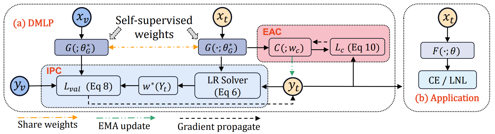
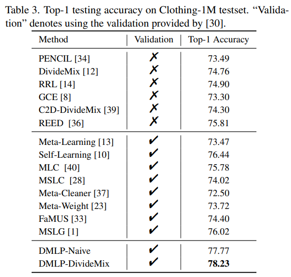

# DMLP
Source code for our CVPR paper Learning from Noisy Labels with Decoupled Meta Label Purifier

# Learning from Noisy Labels with Decoupled Meta Label Purifier (CVPR 2023) 

This is the pytorch implementation of the [paper](https://openaccess.thecvf.com/content/CVPR2023/papers/Tu_Learning_From_Noisy_Labels_With_Decoupled_Meta_Label_Purifier_CVPR_2023_paper.pdf) (accepted by CVPR 2023).



**Fig 1**.DMLP framework

# Training
First download the features and corresponding noisy labels in [labels](https://drive.google.com/drive/folders/1tXjRrf_W-ilvjARWqXVevVbLJR9IOkat?usp=sharing) to the folder labels_cifar10.

Then purify the noisy labels of CIFAR-10 with symmetric 20% noise rate:

```
python DMLP.py
```

Or you can directly use the purified labels of CIFAR-10, the corresponding files are in [labels](https://drive.google.com/drive/folders/1tXjRrf_W-ilvjARWqXVevVbLJR9IOkat?usp=sharing).

To achieve better performance, you can combine the purified labels with existing methods to boost their accuracy (i.e., [C2D](https://github.com/ContrastToDivide/C2D) and [DivideMix](https://github.com/LiJunnan1992/DivideMix)).

# Performance



# TODO
[ ] Release the pretrained weights of MoCo on Clothing1M.

[ ] Release the purified labels on CIFAR-100 and Clothing1M.


# Videos
For the introduction of the paper, you can refer to [bilibili](https://www.bilibili.com/video/BV13w411A7Nk/?spm_id_from=333.337.search-card.all.click) or [youtube](https://www.youtube.com/watch?v=2m2yONAhiuw&t=141s) for more details.

## Citation 
If you find DMLP useful in your research, please consider citing.

```
@inproceedings{tu2023learning,
  title={Learning from noisy labels with decoupled meta label purifier},
  author={Tu, Yuanpeng and Zhang, Boshen and Li, Yuxi and Liu, Liang and Li, Jian and Wang, Yabiao and Wang, Chengjie and Zhao, Cai Rong},
  booktitle={Proceedings of the IEEE/CVF Conference on Computer Vision and Pattern Recognition},
  pages={19934--19943},
  year={2023}
}
```


## Reference
Pretrained-weights of SimCLR (CIFAR-10/CIFAR-100) and MoCo (Clothing1M) for the feature extraction can be referred in [Simclr](https://github.com/google-research/simclr) and [MoCo](https://github.com/facebookresearch/moco).

For C2D and DivideMix, you can refer to [C2D](https://github.com/ContrastToDivide/C2D) and [DivideMix](https://github.com/LiJunnan1992/DivideMix) and combine them with our purified labels. Thanks for their great work!


